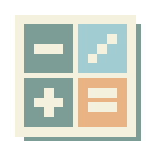
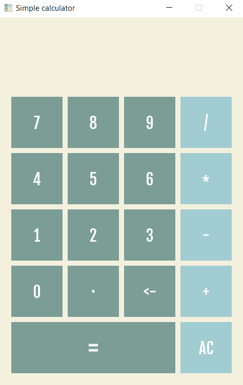

<a name="readme-top"></a>

<!-- PROJECT LOGO -->
<br />
<div align="center">
  <a href="https://github.com/duckmaniac/simple-calculator">
    
  </a>

  <h3 align="center">Simple Calculator GUI Based</h3>

  <p align="center">
    I have built lightweight and intuitive calculator application built with C++ and powered by the SFML library.
    <br />
    Perform basic arithmetic operations with a sleek, user-friendly interface.
    <br />
    <a href="https://github.com/duckmaniac/simple-calculator/issues">Report Bug</a>
  </p>
</div>

<!-- TABLE OF CONTENTS -->
<details>
  <summary>Table of Contents</summary>
  <ol>
    <li>
      <a href="#about-the-project">About The Project</a>
      <ul>
        <li><a href="#built-with">Built With</a></li>
      </ul>
    </li>
    <li>
      <a href="#getting-started">Getting Started</a>
      <ul>
        <li><a href="#prerequisites">Prerequisites</a></li>
        <li><a href="#installation">Installation</a></li>
      </ul>
    </li>
    <li><a href="#contributing">Contributing</a></li>
    <li><a href="#license">License</a></li>
    <li><a href="#contact">Contact</a></li>
    <li><a href="#acknowledgments">Acknowledgments</a></li>
  </ol>
</details>

<!-- ABOUT THE PROJECT -->
## About The Project

<a href="https://github.com/duckmaniac/simple-calculator">
  
</a>

Here's my first attempt at a C++ GUI project: a straightforward calculator using the SFML library. This project was a big step for me. I learned a lot, and some of its code even became the basis for my own small game engine. I hope it inspires others to start their projects too 🚀

Features:
* Basic arithmetic operations: addition, subtraction, multiplication, division
* Keyboard and mouse input support
* Clear and responsive UI

<p align="right">(<a href="#readme-top">back to top</a>)</p>


<!-- GETTING STARTED -->
## Getting Started

### Prerequisites

Before you start your calculating journey, ensure:

* You have a CMake to build a project.
* The Boost 1.83.0 and SFML 2.6.0 library is set up and ready.
* In order to run this code, you will need a Windows operating system.

### Installation

1. Clone the repo
   ```sh
   git clone https://github.com/duckmaniac/simple-calculator.git
   ```
2. Navigate to project's root directory
   ```sh
   cd "path to dowloaded repo"
   ```
3. Set up path to libraries in CMakeLists.txt
   ```cmake
   set(CPP_LIBRARIES_DIR "path to libraries")
   set(SFML_DIR "${CPP_LIBRARIES_DIR}/SFML-2.6.0/lib/cmake/SFML")
   set(BOOST_ROOT "${CPP_LIBRARIES_DIR}/Boost/boost_1_83_0")
   ```
4. Run the configuration command
   ```sh
   cmake .
   ```
5. Build the project
   ```sh
   cmake --build .
   ```

<p align="right">(<a href="#readme-top">back to top</a>)</p>


